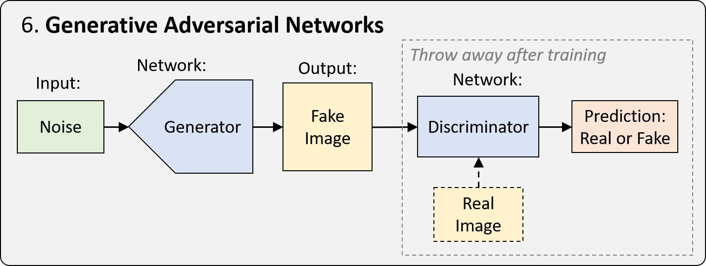

# Deep Learning Basic

High level view -> neural network는 인코더, 디코더의 결합이라고 볼 수 있음

인코더는 입력값(input)으로부터 어떠한 결과물(representation)을 생성해주는 역할을 하고
디코더는 그 결과물을 이용해 새로운 유용한 것을 만드는 역할을 함

크게보면 3가지 타입으로 나눌 수 있음

- Supervised Learning (지도 학습)
  - Feed forward neural network -> classification
  - Convolutional neural network  -> image
  - Recurrent neural network  -> sequence input
  - Encoder-decoder architecture  -> anything
- Unsupervised Learning (비지도 학습)
  - Autoencoder
  - Generative adversarial network
- Reinforcement Learning (강화 학습)
  - Learning action, value, policy

# Generative Adversarial Network (GAN)

특정한 input으로부터 새로운 sample을 만들어내기 위한 framework

학습 과정에서는 두 네트워크가 필요함

하나는 generator라 불리는 네트워크로 입력값으로부터 결과물을 만들어내는 네트워크로 학습 과정이 끝난 후 사용할 때 이용하는 네트워크.

다른 네트워크는 discriminator라 불리는 네트워크로 generator로부터 생성된 결과물과 학습 데이터를 입력값으로 받아 이것이 진짜인지 아닌지 학습하는 역할을 함

크게 보면 3가지 카테고리로 GAN을 나눌 수 있음

- Unsupervised GAN
  - 아무런 input을 받아서 학습 데이터셋에 있는 비슷한 이미지를 만들어내는 방식
- Style-transfer GAN
  - 하나의 도메인에서 다른 도메인으로 변환하는 것
- Conditional GAN
  - input을 넣을 때 특정한 조건을 달아서 이에 해당하는 이미지를 생성해내는 방식?

## Read more

- https://www.samsungsds.com/kr/insights/generative-adversarial-network-ai-2.html
- https://www.samsungsds.com/kr/insights/gan.html

